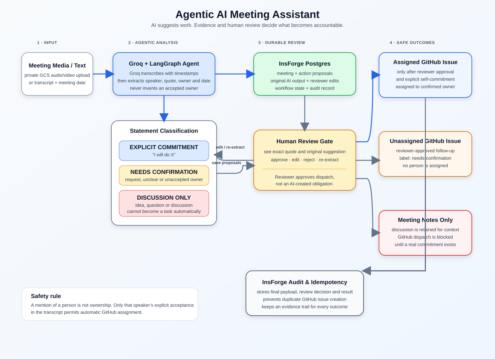

# TechBharat Buildathon — Agentic AI Meeting Assistant

> A safety-first workflow that turns meeting evidence into reviewer-approved GitHub issues. AI proposes tasks; it never creates accountability by itself.

## Architecture



## What lives where

| Service | Responsibility |
|---|---|
| GCP Cloud Storage | Private raw audio/video objects and short-lived signed upload URLs. |
| Groq | Speech-to-text with timestamp evidence, plus structured extraction and current-meeting Q&A. |
| LangGraph | Agent workflow: extract, validate, native reviewer interrupt, and resume. |
| InsForge | Media metadata, transcript segments, action items, reviews, workflow state, and audit records. |
| GitHub | The destination for only reviewer-approved eligible issues. |

## Accountability policy

| Classification | GitHub outcome |
|---|---|
| `EXPLICIT_COMMITMENT` | The speaker directly accepted the work. After review, an issue may be assigned only when a verified GitHub login is supplied. |
| `NEEDS_CONFIRMATION` | A request or unclear ownership. After review, create an unassigned issue with `needs-confirmation`. |
| `DISCUSSION_ONLY` | An idea, question, or discussion. It is blocked from GitHub. |

## Run locally

```powershell
python -m venv .venv
.\.venv\Scripts\Activate.ps1
python -m pip install -r requirements.txt
python -m pytest -q
Copy-Item .env.example .env
uvicorn main:app --reload
```

For the Chainlit UI:

```powershell
chainlit run app.py
```

Configure `.env` with server-only credentials. Do not commit it.

```text
INSFORGE_URL=https://...
INSFORGE_API_KEY=...
GROQ_API_KEY=...
GCP_PROJECT_ID=...
GCS_MEDIA_BUCKET=...
GOOGLE_APPLICATION_CREDENTIALS=C:\path\service-account.json
# or use Mode B: GCS_SERVICE_ACCOUNT_EMAIL with gcloud auth application-default login
# DRY_RUN=true keeps the app in local mock mode; set DRY_RUN=false for live GCS behavior.
DRY_RUN=true
```

### Live GCP setup checklist

The project supports two GCP auth modes for private Cloud Storage uploads:

- Mode A: service account JSON key
  - Set `GOOGLE_APPLICATION_CREDENTIALS` to an absolute Windows path for the service account JSON file.
  - The service account must have `roles/storage.objectAdmin` (or objectCreator + objectViewer) on `GCS_MEDIA_BUCKET`.
- Mode B: Application Default Credentials + signBlob
  - Set `GCS_SERVICE_ACCOUNT_EMAIL` to the target service account email.
  - Run `gcloud auth application-default login` once on the host.
  - The logged-in user must have `iam.serviceAccounts.signBlob` on that service account.
  - The app can also fall back to `gcloud auth application-default print-access-token` if standard ADC refresh paths fail.

Also:

- Confirm `GCP_PROJECT_ID` matches your real GCP project.
- Set `GCS_MEDIA_BUCKET` to the real private bucket name.
- Configure browser CORS on the bucket if using `/upload-ui`:

```json
[
  {
    "origin": ["http://localhost:8000"],
    "method": ["PUT", "GET", "POST", "HEAD", "OPTIONS"],
    "responseHeader": ["Content-Type", "Authorization"],
    "maxAgeSeconds": 3600
  }
]
```

Save it as `cors.json` and apply with:

```powershell
gsutil cors set cors.json gs://<your-bucket>
```

### Live verification steps

1. Set `DRY_RUN=false` in `.env`.
2. Start the API server:

```powershell
uvicorn main:app --reload
```

3. Run the smoke test:

```powershell
python -X utf8 smoke_test_gcs.py
```

4. Open `http://localhost:8000/upload-ui` and upload a supported audio/video file.
5. Confirm the browser upload completes, then check that `/media/{media_id}/transcribe` returns real transcript data.
6. Verify the meeting/media records persist through InsForge.

### Notes

- The UI supports local dry-run mode for development and will simulate uploads when `DRY_RUN=true` or placeholder GCP values are present.
- Real production usage requires `DRY_RUN=false`, valid GCP credentials, a real bucket, and a valid `GROQ_API_KEY`.

## Media flow

The UI accepts supported media files up to 100 MB. The API supports signed uploads up to the configurable 500 MB limit:

1. `POST /media/uploads` with title, meeting date, filename, MIME type, and byte size.
2. Upload bytes to the returned GCS `upload_url` via `PUT`, using the returned `Content-Type` header.
3. `POST /media/{media_id}/confirm-upload`.
4. `POST /media/{media_id}/transcribe`.
5. Review each persisted candidate with `POST /meetings/{meeting_id}/action-items/{action_item_id}/review`.
6. When ready, explicitly call `POST /meetings/{meeting_id}/dispatch`.

The fourth call transcribes the private object, records timestamped segments and extracted candidates in InsForge, then enters the LangGraph review gate. The review endpoint records the original AI proposal and reviewer decision before dispatch is possible. Raw media remains private in GCS; InsForge stores only the object key and durable workflow data.

## Scope

Included now: transcript input, private audio/video uploads, transcription, timestamp evidence, strict commitment classification, reviewer interrupt, current-meeting Q&A, safe GitHub dispatch, and InsForge workflow tables.

Deferred: cross-meeting RAG, Slack/Jira/Linear/email integrations, automatic speaker identity, and video-vision analysis.

## InsForge

The linked InsForge project holds durable application records. Use its CLI through:

```powershell
npx -y @insforge/cli current
```

Never commit `.insforge/project.json`, API keys, service-account files, or other credentials.
