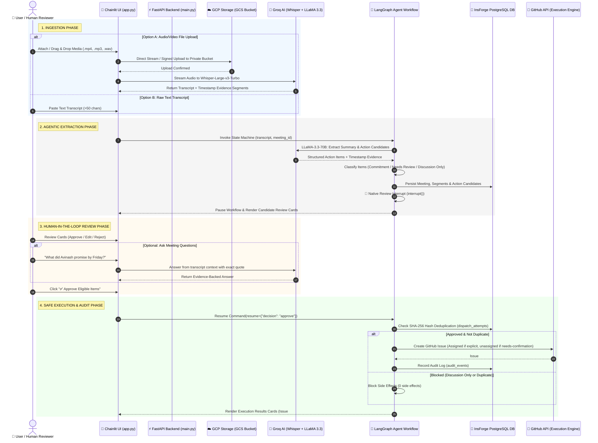

# 🎙️ End-to-End Visual Chat Workflow

This document illustrates the complete end-to-end user journey, data processing pipeline, and safety-first human-in-the-loop review state machine in the **Agentic AI Meeting Assistant**.

---

## 🎨 Visual Workflow Diagram (Mermaid)



---

## 🏛️ System Component Breakdown

| Layer | Component | Function & Responsibility |
|---|---|---|
| **User Interface** | [app.py](file:///c:/Users/sai%20avinash/OneDrive/Desktop/TechBharat/Agentic%20AI%20Meeting%20Assistant/app.py) | Conversational Chainlit Chat UI, file drag & drop, interactive review cards, evidence Q&A. |
| **Backend REST API** | [main.py](file:///c:/Users/sai%20avinash/OneDrive/Desktop/TechBharat/Agentic%20AI%20Meeting%20Assistant/main.py) | FastAPI service exposing `/media/uploads`, `/transcribe`, `/review`, `/dispatch`, `/health`. |
| **Object Storage** | [src/media.py](file:///c:/Users/sai%20avinash/OneDrive/Desktop/TechBharat/Agentic%20AI%20Meeting%20Assistant/src/media.py) | Private GCP Cloud Storage bucket (`agentic-ai-meeting-assistant-media-634824910481`) with IAM SignBlob. |
| **Speech-to-Text** | Groq Whisper | Converts raw audio/video into timestamped transcript segments in ~2 seconds. |
| **LLM Agent** | Groq LLaMA 3.3 70B | Structured candidate extraction, evidence mapping, and evidence-backed meeting Q&A. |
| **State Machine** | [src/graph.py](file:///c:/Users/sai%20avinash/OneDrive/Desktop/TechBharat/Agentic%20AI%20Meeting%20Assistant/src/graph.py) | LangGraph durable workflow with native `interrupt()` human review gate. |
| **Database** | [src/insforge_client.py](file:///c:/Users/sai%20avinash/OneDrive/Desktop/TechBharat/Agentic%20AI%20Meeting%20Assistant/src/insforge_client.py) | InsForge PostgreSQL storing meetings, segments, action items, dedup hashes, and audit logs. |
| **Safety Dispatcher** | [src/execution.py](file:///c:/Users/sai%20avinash/OneDrive/Desktop/TechBharat/Agentic%20AI%20Meeting%20Assistant/src/execution.py) | Ensures only reviewer-approved items trigger GitHub Issue creation; supports `DRY_RUN` safety mode. |

---

## 🛡️ Accountability Tri-Classification Rules

```text
               ┌──────────────────────────────────────────┐
               │    AI Extracted Candidate Action Item    │
               └────────────────────┬─────────────────────┘
                                    │
           ┌────────────────────────┼────────────────────────┐
           ▼                        ▼                        ▼
┌────────────────────┐    ┌────────────────────┐    ┌────────────────────┐
│EXPLICIT_COMMITMENT │    │ NEEDS_CONFIRMATION │    │  DISCUSSION_ONLY   │
│ Speaker accepted   │    │ Unclear request    │    │ Idea/Question      │
└──────────┬─────────┘    └──────────┬─────────┘    └──────────┬─────────┘
           │                         │                         │
           ▼                         ▼                         ▼
   Human Review Gate         Human Review Gate         🚫 STAGE BLOCKED
   Approve & Assign         Approve Unassigned          No GitHub Issue
```
